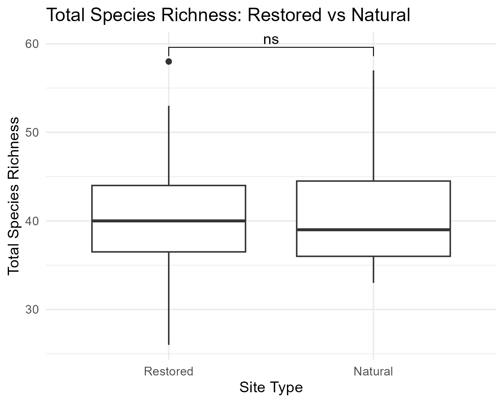
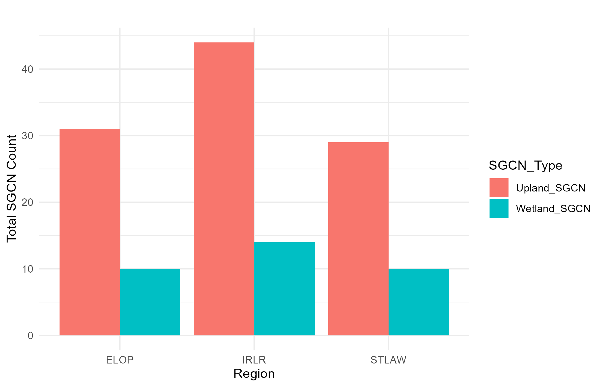
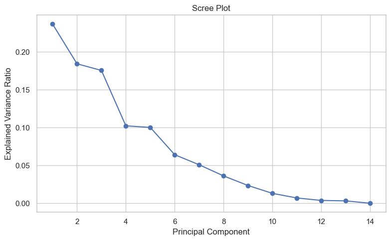
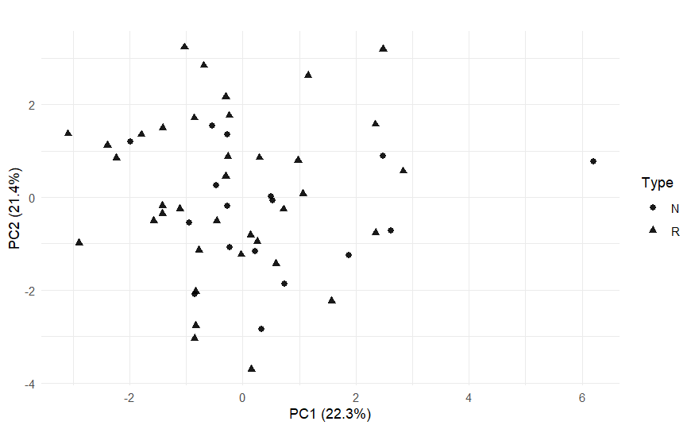

# Wetland Biodiversity Analysis: Restored vs Natural Wetlands

## Project Overview

This project investigates biodiversity patterns across restored and natural wetland ecosystems between 2009 and 2011. Wetlands are important ecosystems because they support many species groups, provide habitat, and contribute to conservation efforts. Wetland restoration is often used to recover damaged ecosystems, but it is important to evaluate whether restored wetlands support biodiversity levels similar to natural wetlands.

This project compares restored and natural wetland sites using biodiversity metrics, statistical testing, and multivariate analysis. The goal is to understand whether restoration efforts are supporting ecological recovery and whether species richness differs meaningfully between restored and natural sites.

## Dataset

The dataset includes biodiversity information from 57 restored and natural wetland sites. It contains species richness and abundance data for multiple taxonomic groups, including birds, anurans, fish, snakes, and turtles. Each site was classified as either restored or natural, allowing biodiversity patterns to be compared across site types.

The dataset was cleaned before analysis by removing invalid records, handling missing values, and preparing biodiversity variables for statistical and multivariate analysis.

## Methodology

The analysis began with data cleaning and preparation to ensure the dataset was suitable for comparison. Descriptive statistics were used to summarize biodiversity patterns across restored and natural wetland sites. Statistical tests were then applied to compare species richness between site types and evaluate whether observed differences were meaningful.

Principal Component Analysis was used to examine broader biodiversity patterns across multiple variables. This helped identify whether biodiversity variation was mainly explained by restoration status or by more complex ecological differences among sites.

## Visualizations

### Field Data Collection

This image shows Dr Tom Langen collecting biodiversity samples at one of the wetland sites. It provides field context for the study and highlights the ecological data collection process behind the analysis.

### Total Species Richness

This boxplot compares total species richness between restored and natural wetland sites.

### Taxa-Specific Species Richness

This bar chart shows taxa-specific species richness patterns across restored and natural wetland sites.

### Scree Plot

This scree plot shows how much variation is explained by each principal component in the multivariate analysis.

### PCA Scatterplot

This scatterplot shows the PCA results used to examine biodiversity variation across wetland sites.

## Statistical Analysis

The analysis used descriptive statistics to summarize biodiversity patterns, t-tests to compare group differences, Levene’s test to assess variance equality, and Principal Component Analysis to explore multivariate biodiversity structure. These methods helped determine whether restored and natural wetlands differed in overall biodiversity and whether restoration status explained major patterns in the data.

## Key Findings

Overall, restored wetlands supported biodiversity levels that were comparable to natural wetlands. Total species richness did not show a major difference between restored and natural sites, suggesting that restoration efforts may be helping recover ecological function.

Taxa-specific richness patterns were also generally similar between restored and natural sites. This suggests that restored wetlands may provide habitat conditions that support multiple species groups, not just one taxonomic category.

The PCA results showed that biodiversity variation was spread across multiple principal components. This means that wetland biodiversity patterns were likely influenced by several ecological factors rather than restoration status alone.

## Conclusion

This project shows that restored wetlands can support biodiversity levels similar to natural wetlands. The findings suggest that wetland restoration can be an effective conservation strategy when restored sites provide suitable habitat for different species groups.

Although restored and natural wetlands showed comparable biodiversity patterns, the multivariate results also show that ecological recovery is complex. Biodiversity is shaped by many interacting factors, including habitat conditions, species composition, site characteristics, and broader environmental gradients.

Overall, this analysis supports the value of restored wetlands in biodiversity conservation and ecosystem management.